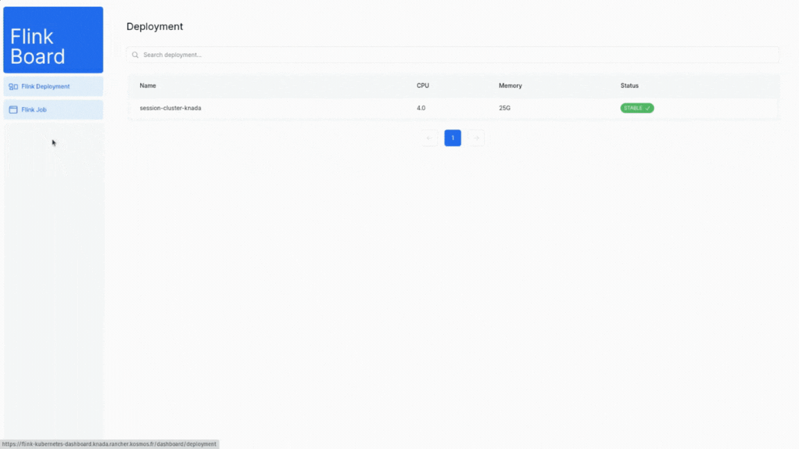

# flink-kubernetes-dashboard

This project is to give an interface with information and action about [Flink-operator](https://github.com/apache/flink-kubernetes-operator)

This repository use  connected with the project [flink-kubernetes-api](https://github.com/EnzoDechaene/flink-kubernetes-api)




## Getting Started

First, run the development server:

```bash
npm run dev
```

Open [http://localhost:3000](http://localhost:3000) with your browser to see the result.

## Use on Kubernetes

If you want to embedded the api and the dashboard you'll need to build and push the docker image to your repository

```bash
make build-and-push
```

The next step is to add the deployment.yaml to generate a Deployment, Service and Ingress Kubernetes Object.
